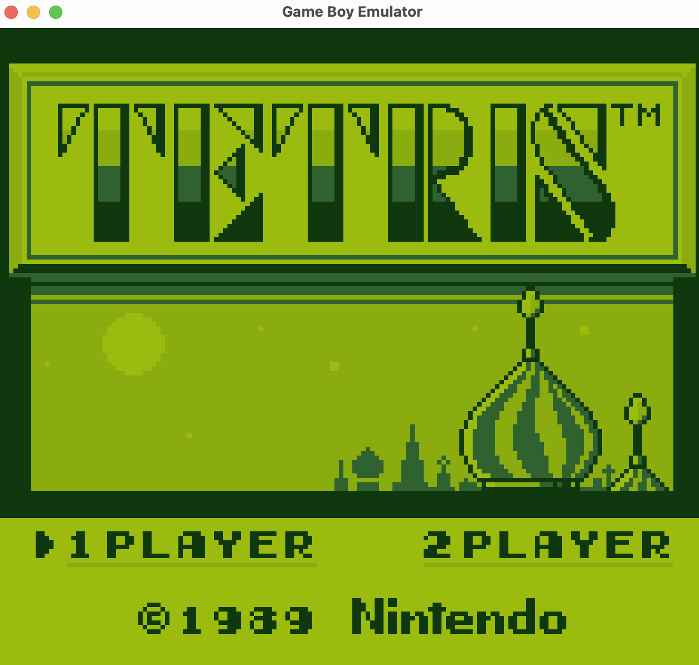
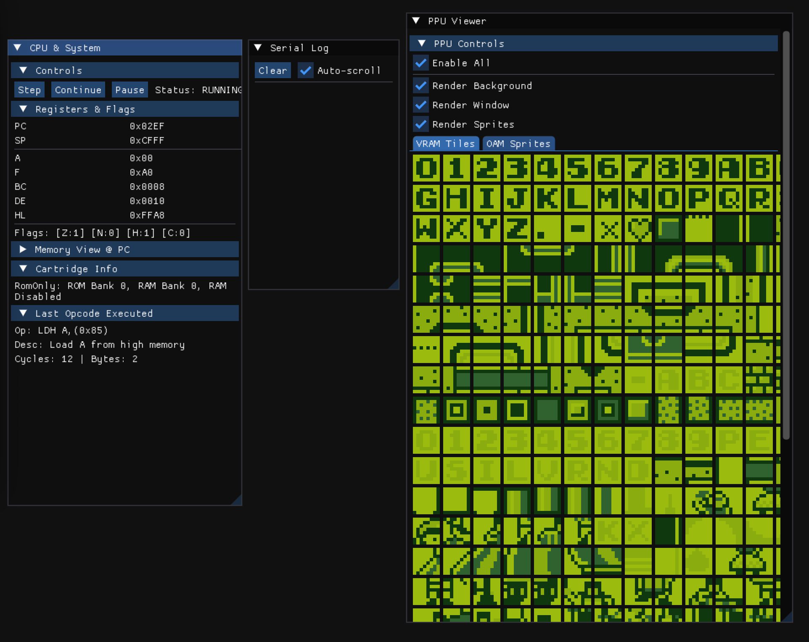

# GameboySharp

A Game Boy and Game Boy Color emulator written in C# with a focus on code clarity and readability.




## Philosophy

This emulator prioritizes clean, understandable code over raw performance optimizations. The goal is to provide a well-documented, educational implementation that accurately emulates the Game Boy hardware while remaining accessible to developers interested in learning about emulation.

## Features

Cross-platform support Windows, macOS, or Linux (via Silk.NET)

### CPU
- Complete implementation of all 256 base opcodes
- Complete implementation of all 256 CB-prefixed (extended) opcodes
- Accurate interrupt handling (V-Blank, LCD STAT, Timer, Serial, Joypad)
- HALT and HALT bug emulation
- Game Boy Color double-speed mode support

### PPU (Pixel Processing Unit)
- Full scanline-based rendering
- Background, Window, and Sprite layers
- Game Boy Color features:
  - VRAM banking
  - Color palettes (Background and Sprite)
  - Sprite priority attributes

### APU (Audio Processing Unit)
- All four sound channels:
  - Channel 1: Pulse with sweep
  - Channel 2: Pulse
  - Channel 3: Wave
  - Channel 4: Noise
- Real-time audio output via OpenAL

### Memory Bank Controllers
- ROM Only
- MBC1
- MBC2
- MBC3 (with RTC support)
- MBC5

### Other
- Joypad input handling
- Timer emulation
- Serial output logging
- Debug window with CPU state visualization

## Requirements

### Runtime Requirements
- **.NET 9.0 Runtime** or SDK
- **OpenGL 3.3** compatible graphics card
- **OpenAL** compatible audio system
- **Operating System**: Windows, macOS, or Linux (via Silk.NET)

### Development Requirements
- **.NET 9.0 SDK** - [Download here](https://dotnet.microsoft.com/download/dotnet/9.0)
- **C# 13** compatible IDE (optional but recommended):
  - Visual Studio 2022 (v17.12+)
  - Visual Studio Code with C# Dev Kit
  - JetBrains Rider 2024.3+
- **Git** - For cloning the repository

## Building

Clone the repository and build using the .NET CLI:

```bash
git clone https://github.com/yourusername/gameboy_sharp.git
cd gameboy_sharp
dotnet build
```

For a release build:

```bash
dotnet build -c Release
```

## Running

1. Place your ROM file in a location accessible to the emulator
2. Update the ROM path in `Program.cs`:
   ```csharp
   emulator.LoadRom("path/to/your/rom.gb");
   ```
3. Run the emulator:
   ```bash
   dotnet run
   ```

Or run the compiled executable directly:

```bash
./bin/Debug/net9.0/GameboySharp
```

### First Run
On first run, you'll see two windows:
1. **Game Window** (640x576) - Displays the Game Boy screen
2. **Debug Window** - Shows CPU state, memory, VRAM, sprites, and controls

The emulator starts **paused** by default. Click **Continue** in the debug window to start execution.

## Controls

### In-Game Controls
| Game Boy Button | Keyboard Key |
|----------------|--------------|
| D-Pad Up       | Arrow Up     |
| D-Pad Down     | Arrow Down   |
| D-Pad Left     | Arrow Left   |
| D-Pad Right    | Arrow Right  |
| A Button       | Z            |
| B Button       | X            |
| Start          | Enter        |
| Select         | Right Shift  |

### Debug Controls
- **Continue** - Resume execution
- **Pause** - Pause execution
- **Step** - Execute one CPU instruction
- **Memory Viewer** - Inspect memory addresses
- **VRAM Viewer** - View tiles and background data
- **Sprite Viewer** - Inspect sprite attributes
- **Serial Output** - View debug messages from ROM

## Project Structure

```
GameboySharp/
├── Core/
│   ├── Cpu.cs          # CPU emulation and opcode implementation
│   ├── Ppu.cs          # Graphics processing unit
│   ├── Apu.cs          # Audio processing unit
│   ├── Mmu.cs          # Memory management unit
│   ├── Timer.cs        # Timer and divider registers
│   ├── Joypad.cs       # Input handling
│   ├── RomHeader.cs    # ROM header parsing
│   └── IORegisters.cs  # I/O register addresses
├── Storage/
│   ├── IMbc.cs         # Memory bank controller interface
│   ├── RomOnly.cs      # No MBC (32KB ROMs)
│   ├── Mbc1.cs         # MBC1 implementation
│   ├── Mbc2.cs         # MBC2 implementation
│   ├── Mbc3.cs         # MBC3 implementation (with RTC)
│   └── Mbc5.cs         # MBC5 implementation
├── Sound/
│   ├── ChannelBase.cs       # Base class for audio channels
│   ├── PulseChannel.cs      # Pulse wave channel
│   ├── PulseWithSweepChannel.cs  # Pulse with frequency sweep
│   ├── WaveChannel.cs       # Wavetable channel
│   ├── NoiseChannel.cs      # Noise channel
│   └── AudioStreamerAL.cs   # OpenAL audio output
├── UI/
│   ├── GameWindow.cs      # Main emulator window
│   ├── DebugWindow.cs     # Debug/inspection window
│   └── ScreenRenderer.cs  # OpenGL rendering
├── Emulator.cs         # Main emulator orchestration
└── Program.cs          # Entry point
```

## Project Status

**Current State: Functional**

The emulator successfully runs many commercial Game Boy and Game Boy Color games. Core functionality is complete:

- All CPU instructions implemented and tested
- PPU renders graphics correctly for most games
- APU produces accurate sound output
- Major MBC types supported

### Known Limitations

- No save state support yet
- No boot ROM emulation (games start directly)
- Some edge-case timing behaviors may differ from real hardware

## Architecture Overview

### Component Design
The emulator follows a **component-based architecture** where each hardware component is isolated:

```
Emulator (Coordinator)
├── CPU (Sharp LR35902)
│   └── Opcodes: 256 base + 256 CB extended
├── MMU (Memory Management)
│   ├── ROM (via MBC)
│   ├── VRAM (8KB x 2 banks)
│   ├── External RAM (via MBC)
│   ├── WRAM (4KB + 4KB x 7 banks)
│   ├── OAM (160 bytes)
│   └── I/O Registers
├── PPU (Graphics)
│   ├── Background rendering
│   ├── Window rendering
│   ├── Sprite rendering
│   └── Frame buffer (160x144 RGBA)
├── APU (Audio)
│   ├── Channel 1: Pulse + Sweep
│   ├── Channel 2: Pulse
│   ├── Channel 3: Wave
│   └── Channel 4: Noise
├── Timer (Timer & Divider)
├── Joypad (Input)
└── MBC (Cartridge Banking)
```

## Development

### Debugging
The emulator includes extensive debugging capabilities:

1. **CPU Debugging**:
   - View all registers in real-time
   - Step through instructions one by one
   - See opcode mnemonics and descriptions
   - Monitor interrupt status

2. **Memory Debugging**:
   - Memory viewer with hex/ASCII display
   - Watch specific memory addresses
   - View MBC state (current ROM/RAM banks)

3. **Graphics Debugging**:
   - View all 384 tiles from VRAM
   - Inspect sprite attributes (position, tile, flags)
   - View GBC palettes in real-time
   - Toggle rendering layers (BG, Window, Sprites)

4. **Logging**:
   - Serilog structured logging
   - Console output (Info level)
   - File output: `logs/log-YYYYMMDD.txt`
   - Serial data output in debug window

## Dependencies

- [Silk.NET](https://github.com/dotnet/Silk.NET) - Windowing, input, OpenGL, and OpenAL bindings
- [ImGui.NET](https://github.com/mellinoe/ImGui.NET) - Debug UI
- [Serilog](https://serilog.net/) - Logging

## License

This project is provided for educational purposes.

## Acknowledgments

- [Pan Docs](https://gbdev.io/pandocs/) - Comprehensive Game Boy technical reference
- [gbdev community](https://gbdev.io/) - Resources and test ROMs
- [Blargg's test ROMs](https://github.com/retrio/gb-test-roms) - CPU instruction tests
